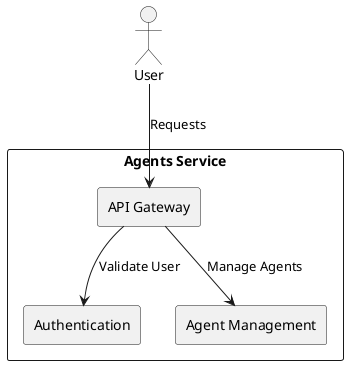
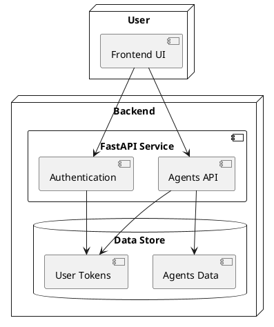
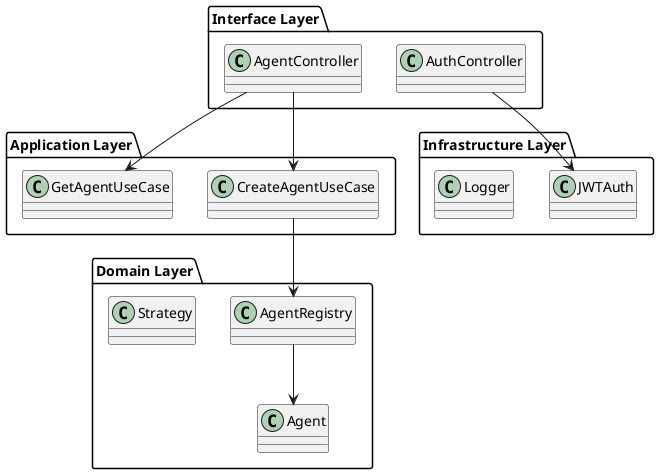

# Agents Service

## Overview
The **Agents Service** is a backend system designed to orchestrate and manage AI-driven agents following **agentic design patterns**. The service integrates various agents, strategies, and execution frameworks, exposing a **secure and extensible API** using **FastAPI**.

## Key Features
- **Agent Management**: Create, manage, and query agents dynamically.
- **Security**: Authentication and authorization with JWT.
- **Multiple Interfaces**: Support for REST, WebSockets, and future extension to gRPC or GraphQL.
- **Modular Architecture**: Based on Clean Architecture and DDD.
- **Scalability**: Designed for future microservice adoption.

---

## Architecture Overview
The **Agents Service** follows the **Clean Architecture** principles, ensuring separation of concerns and maintainability. It is structured into the following layers:

1. **Core Domain**
   - Agents and Strategy Modules
   - Registry for managing agent lifecycles
   - Protocols for dependency inversion

2. **Application Layer**
   - Use Cases for agent operations
   - DTOs and Value Objects for consistent data handling

3. **Infrastructure Layer**
   - Security module for authentication and authorization
   - Logging and configuration management

4. **Interface Layer (Presenters)**
   - FastAPI-based REST controllers
   - Authentication endpoints

---

## C4 Model Diagrams

### Context Diagram

### Container Diagram

### Component Diagram

---

## Next Steps
- **Refine Diagrams**: Add deployment and sequence diagrams.
- **Detail Use Cases**: Write specifications for each application use case.
- **Define API Contracts**: Standardize request and response models.
- **Write Usage Guides**: Provide documentation for developers.

This structured documentation will ensure a well-guided development process with a clear architectural vision! 🚀
