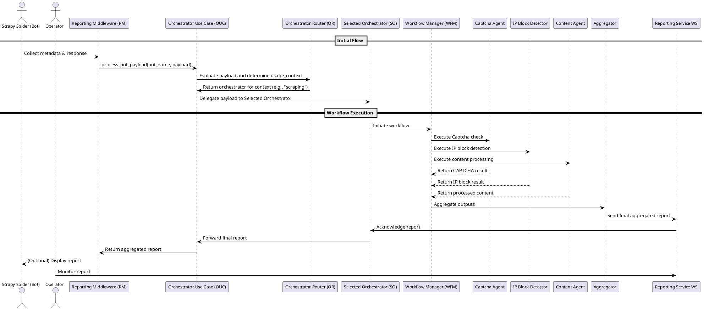
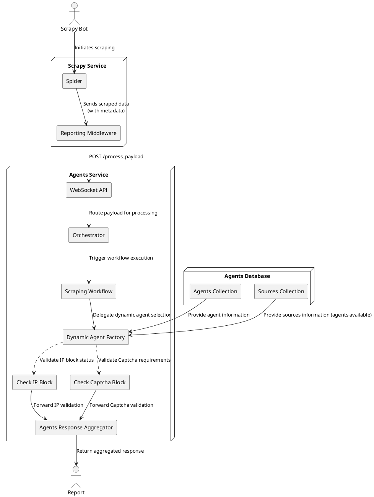

# Scrapy Integration Example

This example demonstrates how to integrate the Agents Service with a Scrapy-based web scraping project. The service leverages a modular, multi-agent architecture to process and analyze scraped data while providing advanced error reporting and detection capabilities via WebSocket connections.

---

## Overview

In this integration, a Scrapy spider retrieves data from target websites. The scraped data (e.g., the HTTP response) is enriched with metadata and passed to the Agents Service. The service processes the payload through a defined workflow that includes:

- **Block Detection**
  - **IP Block Detection**: Uses deterministic checks (HTTP status, headers) and low-cost LLM-augmented analysis to determine if the request was blocked due to IP issues.
  - **Captcha Block Detection**: Analyzes the response body for common CAPTCHA indicators.

- **Aggregation**
  An aggregator node merges the outputs from the block detection agents and the content processing branch into a single combined output. This allows operators to quickly determine whether the scraped data is usable or if the request was blocked.

- **Error Reporting**
  Dedicated Scrapy extensions capture error messages (via signals such as `spider_error` or `spider_closed`) and send these errors via WebSocket to an external reporting service, ensuring that any issues during scraping are promptly reported for further analysis.

---

## Architecture

The architecture is divided into several key components. Below is a high-level overview, followed by detailed diagrams and descriptions.

### High-Level Components

- **Scrapy Service**
  The Scrapy spider collects web data and associated metadata (HTTP response, headers, a snippet of the body). This data is forwarded to the Agents Service for processing.

- **WebSocket Input Channel**
  The Reporting Middleware collects metadata from Scrapy and sends it via a WebSocket connection to the Orchestrator.

- **Orchestrator & Workflow Manager**
  The Orchestrator evaluates the payload, dispatches it to the appropriate agents based on the use case (e.g., "scraping"), and aggregates their outputs.

- **Specialized Agents**
  Each agent is responsible for a specific task. For example:
  - **IP Block Detector**: Checks HTTP status and headers to determine if a request is blocked.
  - **Captcha Block Detector**: Scans the response body for CAPTCHA indicators.
  - **Content Processing Agents**: Generate, improve, and polish content (e.g., a joke) based on the scraped topic.

- **WebSocket Output Channel**
  The aggregated results and error reports are sent via WebSocket to external monitoring or reporting systems.

- **Error Reporting Extensions**
  These capture errors and report them via WebSocket.

### Sequence Diagram

The following PlantUML sequence diagram shows the flow of data between components:



### C4 Diagrams

The following C4 diagrams illustrate the system at various levels of detail.

#### 1. Container Diagram



---

## Registering Agents & Sources

The system provides REST API endpoints for registering agents and sources. A **source** represents a context (e.g., "scraping") and contains all the agents available for that context. This allows the service to be dynamically extended and reconfigured without code changes.

### REST API Endpoints

- **Register Agent**
  `POST /api/agents`
  **Payload Example:**
  ```json
  {
      "alias": "ip_detector",
      "class_path": "agents.block_detector_agents.IPBlockDetectorAgent",
      "config": {}
  }
  ```
  Registers a new agent implementation with the system.

- **Register Source**
  `POST /api/sources`
  **Payload Example:**
  ```json
  {
      "source": "scraping",
      "agents": [
          "ip_detector",
          "captcha_detector",
          "joke_generator",
          "joke_improver",
          "joke_polisher"
      ]
  }
  ```
  Associates a set of agent aliases with a specific source, enabling the orchestrator to select the appropriate agents for processing incoming payloads.

### Usage

When a payload arrives, the orchestrator queries the source registry to determine which agents to invoke for the given usage context (e.g., "scraping"). The orchestrator then dynamically creates agent instances using the dynamic agent factory, processes the payload through the workflow, and returns the aggregated result.

---

## Customization

- **Adding/Modifying Agents**:
  Create or update agents in the `packages/agents-graph/agents/src/agents/` directory and register them via the REST API.

- **Workflow Configuration**:
  Modify the workflow logic in `packages/agents-graph/agents-workflows/src/agents_workflows/` to add, remove, or change nodes and edges.

- **Error Reporting**:
  Customize error reporting in Scrapy extensions (e.g., `src/scrapy_agent/extensions.py`) to integrate with your preferred alerting system (e.g., email, Slack, etc.).

- **Source Registration**:
  Use the REST endpoints to dynamically configure sources and the associated agents, enabling flexible processing pipelines for different use cases.
