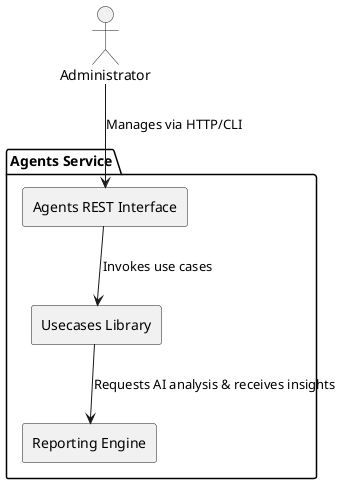

# Agents Service

## Overview

The Agents Service is a versatile, resilient solution designed to collect, analyze, and report on operational transactions from various domains. Initially built to handle web scraping transactions—capturing detailed metadata such as HTTP requests/responses, headers, and body content—the service is engineered with a modular architecture that supports diverse use cases.

This robust system leverages AI-driven analysis to detect anomalies, optimize performance, and provide actionable insights for data engineers and system administrators. Its design is future-proof: as new requirements emerge, the Agents Service can easily incorporate additional data sources and analytical capabilities, extending its reach well beyond its original scope. Whether monitoring network traffic, processing API interactions, or integrating other data streams, the service ensures seamless adaptation and continuous improvement.

## Key Components

The service is composed of several distinct components, each with a well-defined responsibility:

### Configuration

The service is highly configurable via environment variables and configuration files. Key parameters include:
- **Logging Level:** Set the verbosity of the logs for debugging or production.

Configuration can be managed through a central config file (e.g., config/core.py) or via environment variables as outlined in the [Config README](../packages/config/README.md).

### **Presenters**

Presenters are responsible for exposing the processed data through various interfaces:
- **REST API:** Provides endpoints for clients to retrieve reports, manage agents, or manage configurations.
- **WebSocket Interface:** Enables real-time communication with connected clients, streaming updates and notifications as soon as analysis results become available.
- **CLI Tools:** Facilitates direct command-line interaction for quick diagnostics, monitoring, or administrative tasks.

For more detailed information on each presenter and how to leverage them, please refer to the [Presenters README](../packages/presenters/README.md).

Each presenter leverages a dedicated usecases library to encapsulate business logic and maintain a clean separation of concerns.

## Use Cases

The Agents Service encapsulates its business logic through a series of well-defined use cases. Each use case is responsible for a specific operation within the service and is designed with clean interfaces and dependency inversion in mind. This section details the primary use cases that drive the service’s functionality.

### Some Use Cases

- **Get Agent Use Case:** Retrieves detailed information about a specific agent using its unique identifier.
- **Create Agent Use Case:** Handles the creation of a new agent and its registration in the system.
- **Orchestrator Use Case:** Processes incoming payloads, determines the appropriate orchestrator based on the usage context, and delegates processing.

For further details on the usecases library and its implementation, please refer to the [Usecases README](../packages/application/README.md).

## Architecture Diagram (PlantUML)

Below is a PlantUML snippet that visually represents the relationships between the presenters and use cases:

